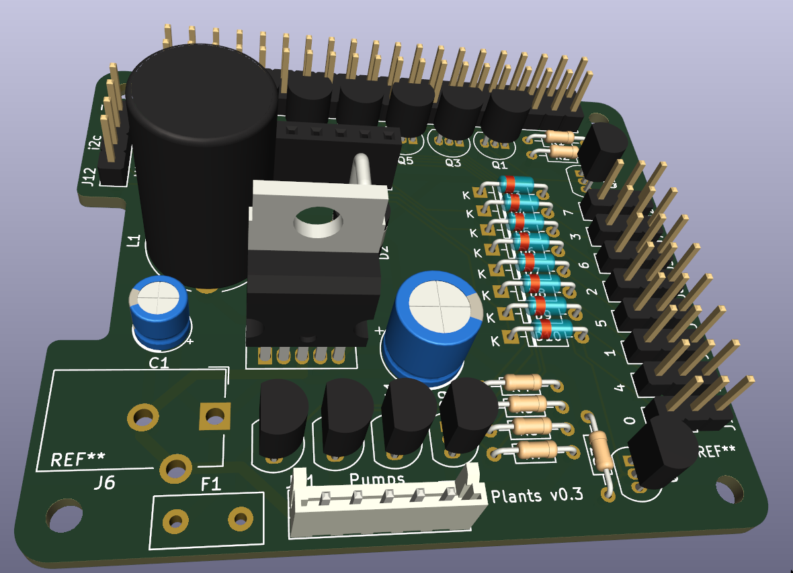

# Plants hat
*Disclaimer: I'm using this project to learn electronics. Use at your own risks and feel free
to reach out with suggestions.*

## Features
 * i2c ADS1115 ADC (+5v) and 8 sensor ports (pinout +5v,GND,out)
 * re-exports the i2c bus for more advanced sensors
 * powers 4 12v (water pumps, .. devices)
   * Transistors Q{5..8} and polyswitch fuse (also missing in the above 3d image) max current:
     *s8550*: .7A, *ss8550*: 1.5A, mosfets may be an option.
   * current tested setup uses 4.8w (400mA) pumps
 * 12v barrel jack (missing in the above 3d image) powers the pumps and an LM2576 that provides
   5v switched power to the Pi and sensors.
  * **WARNING** This project does **not** include a security diode on the +5v supply. When +12v
    is connected to the board, **no USB power should be plugged in**. Running a
    sensors-only board from USB power leaving the 12v barrel empty
    has not been tested but should work.

## Specifics
 * Sensor ports are divided in two groups of 4
   * Sensors 0,1,2,3 turn on with GPIO11
   * Sensors 4,5,6,7 turn on with GPIO9
   * Data should be read on ADS1115 AIN0,1,2,3
 * Pumps 0,1,2,3 are activated with GPIO17, GPIO27, GPIO22, GPIO10
   * Output JST pinout is GND,0,1,2,3
 * Polyfuse value needs to be adjusted - For 4.8w 240l/h 12v pumps, I use 400mA as it takes
   time to trip it.
