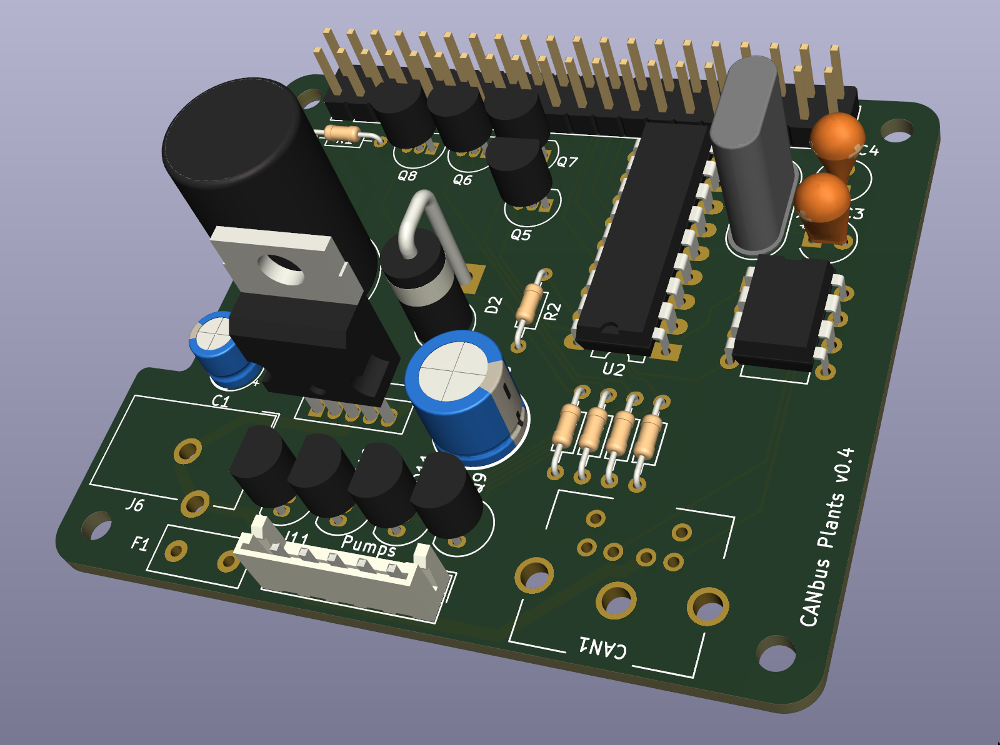

# Canbus hat for raspberry Pi
*Disclaimer: I'm using this project to learn electronics. Use at your own risks and feel free
to reach out with suggestions.*

This hat provides +12v power supply to a Raspberry Pi and the CAN bus,
has a few 12v switches for water pumps, and integrates an MCP2515 chip to
enable the Pi to talk on the bus.

## Configuring CAN for the Pi
Uncomment/add these lines to /boot/config.txt:
```
dtparam=spi=on
dtoverlay=mcp2515-can0,oscillator=8000000,interrupt=25
dtoverlay=spi0-hw-cs
```


## Features
 * 1Mb/s MCP2515 + MCP2561 CAN bus hat for Raspberry pi
 * Also powers 4 12v devices w/ GPIO switches (water pumps, ..), spec:
   * Transistors Q{5..8} and polyswitch fuse max current:
     *s8550*: .7A, *ss8550*: 1.5A, mosfets may be an option.
   * current tested setup uses 4.8w (400mA) pumps
 * 12v barrel jack (missing in the above 3d image) powers the pumps and an LM2576
   that provides 5v switched power to the Pi. +5v and +12v are also exported to the
   CAN bus modules via the PS/2 (alternative TBD RJ11) port for use by [the sensors](../canbus).
  * **WARNING** This project does **not** include a security diode on the +5v supply. When +12v
    is connected to the board, **no USB power should be plugged in**.

## Specifics
 * Pumps 0,1,2,3 are activated with GPIO4,GPIO17, GPIO27, GPIO22
   * Output JST pinout is GND,0,1,2,3
 * GPIO GPIO25(22) is connected to INT on the MCP chip. The can module config should
   use `dtoverlay=mcp2515-can0,oscillator=8000000,interrupt=25`.
 * Polyfuse value needs to be adjusted - For 4.8w 240l/h 12v pumps, I use 400mA as it takes
   time to trip it.

### Alternative way to make Pi talk CAN via SPI:
You can also use a ~$3 MCP2515+TJA1050 module with an 8mhz crystal.

Connecting to Pi:
 * GPIO8(24) to CS
 * GPIO10(19) to MOSI
 * GPIO9(21) to MISO
 * GPIO11(23) to SCLK
 * GPIO GPIO25(22) to INT, so the above config works.
