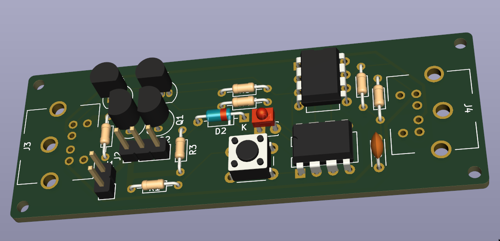

## Canbus stuff
*Disclaimer: I'm using this project to learn electronics. Use at your own risks and feel free
to reach out with suggestions.*

### Hat
This sensor module is to be used with this [Raspberry Pi hat](../canbus-hat).

### Sensors
Sensors are daisy chained on a low bitrate two-wires BUS
(using CANbus transceiver & protocol, at 20kbps).

Sensor circuit is an attiny85 coupled to an MCP2561.
 * +5v generic sensor + ADC
 * 12v 1A module (e.g. water pump, valve)
 * reset button



### AVR programming and setup
On ubuntu linux:
```
sh$ git submodule init && git submodule update
sh$ sudo apt-get install avrdude avr-libc binutils-avr gcc-avr
sh$ cd avr && make && make avr-install
```
